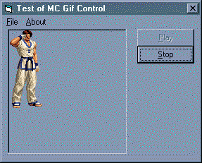



## mcgif

### Description

Show animated gifs in Visual Basic programms.
 
### More Info
 

             |
---                |---
**Submitted On**   |2000-05-23 16:12:16
**By**             |[Mauricio Cunha](https://github.com/Planet-Source-Code/PSCIndex/blob/master/ByAuthor/mauricio-cunha.md)
**Level**          |Advanced
**User Rating**    |3.8 (19 globes from 5 users)
**Compatibility**  |VB 5\.0, VB 6\.0
**Category**       |[OLE/ COM/ DCOM/ Active\-X](https://github.com/Planet-Source-Code/PSCIndex/blob/master/ByCategory/ole-com-dcom-active-x__1-29.md)
**World**          |[Visual Basic](https://github.com/Planet-Source-Code/PSCIndex/blob/master/ByWorld/visual-basic.md)
**Archive File**   |[CODE\_UPLOAD60345232000\.zip](https://github.com/Planet-Source-Code/mauricio-cunha-mcgif__1-8284/archive/master.zip)

